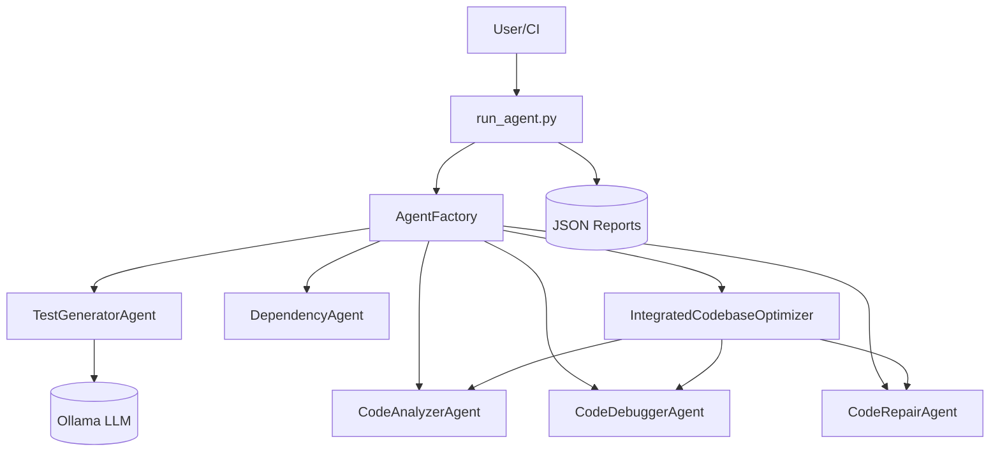

# MindMeld Architecture



This diagram shows the main agent orchestration and reporting flow. See `README.md` for more details.

## Data Flows

### Test Generation Flow
- **Input:** Module path
- **Process:** LLM-based test generation (TestGeneratorAgent → Ollama)
- **Output:** Pytest-compatible test code

### Dependency Analysis Flow
- **Input:** Directory path
- **Process:** AST parsing of Python files (DependencyAgent)
- **Output:** Map of files to their imports

### Code Analysis Flow
- **Input:** Directory path
- **Process:** File scanning and content extraction (CodeAnalyzerAgent)
- **Output:** Map of files to their content

### Debug-Repair Flow
- **Input:** File content with potential errors
- **Process:**
    1. `CodeDebuggerAgent`: py_compile checking
    2. Line identification of errors
    3. `CodeRepairAgent`: code modification
- **Output:** Fixed file content and diagnostic information

This section describes the main data flows and agent responsibilities in the MindMeld system. Each agent is responsible for a specific part of the analysis, and the IntegratedCodebaseOptimizer orchestrates a full analyze → debug → repair cycle.

## Agent Interfaces

### TestGeneratorAgent
- **Input:** `module_path: str`, optional `bug_trace: str`
- **Output:** `str` (pytest-compatible test code)
- **Method:** `generate_tests(module_path, bug_trace=None)`

### DependencyAgent
- **Input:** `path: str` (directory path)
- **Output:** `dict[str, list[str]]` (file → list of imports)
- **Method:** `analyze_deps(path)`

### CodeAnalyzerAgent
- **Input:** `root_dir: str` (directory path, default ".")
- **Output:** `dict[str, str]` (file → file content)
- **Method:** `analyze(max_file_size_mb=5)`

### CodeDebuggerAgent
- **Input:** `file_content: str`
- **Output:** `str` ("No syntax errors" or error message)
- **Method:** `locate_bugs(file_content)`

### CodeRepairAgent
- **Input:** `file_content: str`, `diagnostics: str`
- **Output:** `str` (fixed file content)
- **Method:** `generate_fix(file_content, diagnostics)`
- **Test Method:** `test_solution(file_path)`

### IntegratedCodebaseOptimizer
- **Input:** `target_file: str`
- **Output:** `dict` (diagnostics and fix status)
- **Method:** `optimize(target_file)`

This section summarizes the expected interface for each agent, including method signatures and input/output types, to support integration, testing, and extension.

## 4. Required Files and Additional Context

### Core Files

- **Agent Implementation**:
  - `agents.py` - Contains all six agent implementations
  - `AgentFactory.py` - Agent registry and factory methods
  - `config.py` - Configuration constants for models and runtime settings
  - `vector_memory.py` - Vector storage for semantic operations

- **Runner Scripts**:
  - `run_agent.py` - CLI harness for running individual agents
  - `run_all_agents.sh` - Shell script for running all agents on a target
  - `agent_report_schema.json` - JSON schema for validating agent reports

- **CI/CD Configuration**:
  - `.github/workflows/generate-and-run-tests.yml` - GitHub Actions workflow

### Recommended New Files

- **Error Handling**:
  - `exceptions.py` - Custom exception hierarchy for agents
  - `logging_config.py` - Centralized logging configuration

- **Testing**:
  - `tests/test_agents.py` - Unit tests for agent functionality
  - `tests/fixtures/` - Test fixtures and sample code files

- **Documentation**:
  - `docs/architecture.md` - System architecture documentation
  - `docs/agent_interfaces.md` - Documentation of agent interfaces
  - `docs/workflows.md` - Common usage patterns and workflows

### External Dependencies

- **Environment**:
  - Ollama service running and accessible
  - Required models pulled (`phi3.5:latest` as default)
  - Python 3.8+ with required packages

- **Python Packages**:
  - ollama - For LLM API calls
  - torch - For neural network operations if using embeddings
  - transformers - For embedding models
  - sentence_transformers - For semantic operations
  - faiss - For vector search capabilities
  - jsonschema - For validating agent output reports

### Setup Instructions

1. Install required packages:
   ```sh
   pip install -r requirements.txt
   ```
2. Ensure Ollama is running:
   ```sh
   ollama serve &
   ```
3. Pull required models:
   ```sh
   ollama pull phi3.5:latest
   ```
4. Set environment variables:
   ```sh
   export OLLAMA_MODEL=phi3.5:latest
   ```
5. Run all agents:
   ```sh
   ./run_all_agents.sh
   ```

This implementation plan addresses the critical issues in the current codebase while providing a clear path for enhancing the MindMeld project to be more robust, performant, and maintainable.
