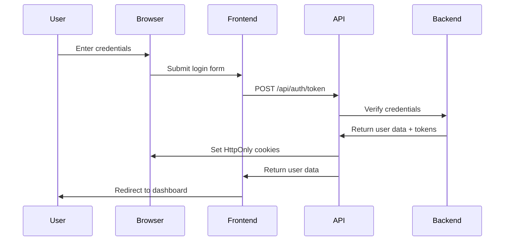
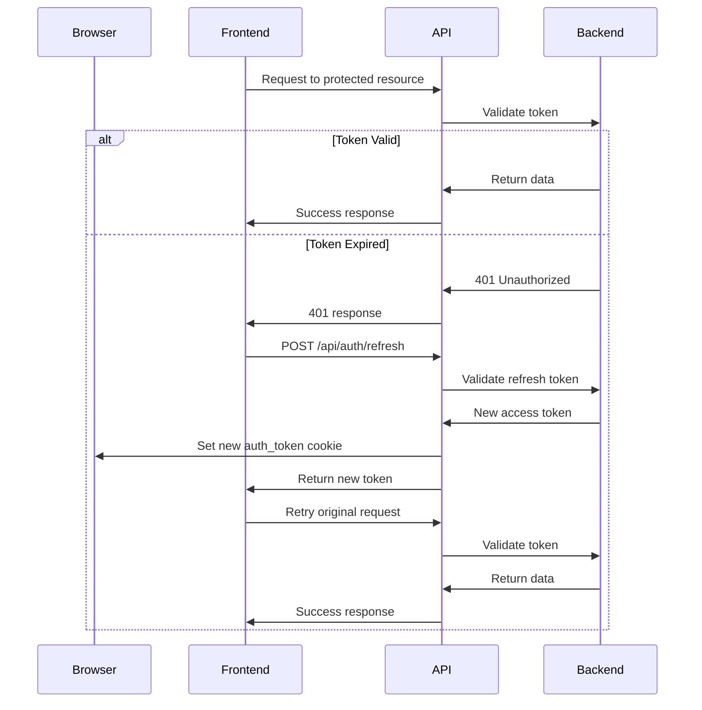
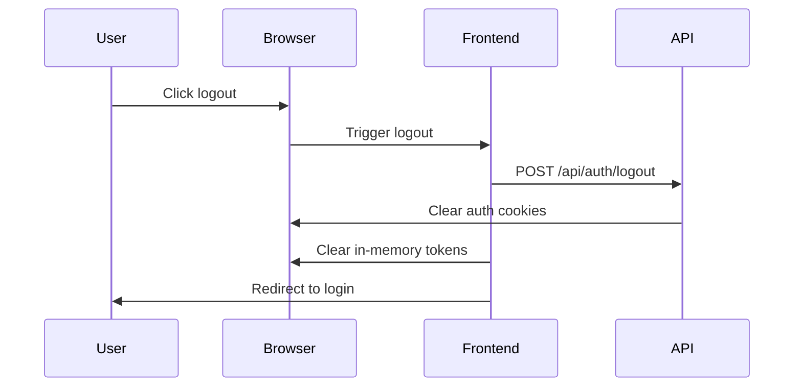

# Authentication Architecture

## Overview

MindMeld uses a secure, cookie-based authentication system with the following key components:

1. **HttpOnly Cookies** for secure token storage 
2. **In-memory Access Tokens** for client-side authorization
3. **Automatic Refresh Token** flow for seamless session management
4. **CORS-protected API Proxy** for secure external service integration

## Authentication Flow

### Login Process

1. User submits login credentials
2. Frontend sends credentials to `/api/auth/token` endpoint
3. Server validates credentials and:
   - Sets `auth_token` (1 hour) as HttpOnly cookie
   - Sets `refresh_token` (7 days) as HttpOnly cookie
4. Frontend receives user data and establishes session

### Token Refresh Flow

1. When access token expires (401 response):
   - Frontend automatically calls `/api/auth/refresh`
   - Server validates the refresh token from HttpOnly cookie
   - If valid, issues new access token and updates the cookie
   - Frontend retries the original request
2. Periodic refresh (every 15 minutes) to prevent expiration

### Logout Process

1. User triggers logout
2. Frontend calls `/api/auth/logout` endpoint
3. Server clears all auth cookies by setting their expiry to 0
4. Frontend clears any in-memory tokens
5. User is redirected to login page

## Security Features

### Token Storage
- **Refresh Tokens**: Stored as HttpOnly, SameSite=Strict, Secure cookies (when in production)
- **Access Tokens**: 
  - Stored as HttpOnly cookies for API requests
  - Temporarily stored in memory (not localStorage/sessionStorage) for frontend use

### Cross-Origin Security
- SameSite=Strict cookies prevent CSRF attacks
- Secure flag ensures cookies only sent over HTTPS in production
- Proper CORS headers to prevent unauthorized cross-origin requests

### External API Integration
- Reverse proxy pattern for all external API calls:
  - Frontend → `/api/proxy/[service]/[path]` → External API
  - Prevents CORS issues and adds authentication layer
  - Allows for request/response transformation
  - Centralizes external API access control

## API Authentication Routes

| Endpoint | Method | Purpose | Request | Response |
|----------|--------|---------|---------|----------|
| `/api/auth/token` | POST | User login | `{ email, password }` | Sets cookies, returns user data |
| `/api/auth/refresh` | POST | Refresh access token | No body, uses cookie | Sets new cookie, returns new token |
| `/api/auth/logout` | POST | User logout | No body | Clears cookies |
| `/api/auth/validate` | GET | Validate session | No body, uses cookie | Session validity status |
| `/api/auth/user` | GET | Get user profile | No body, uses cookie | User profile data |

## Implementation Details

1. **Frontend AuthService**
   - No localStorage/sessionStorage for token storage
   - In-memory token variable (closure scope)
   - Automatic token refresh mechanism
   - Auth status polling

2. **NextJS Middleware**
   - Protects routes based on auth cookie presence
   - Redirects unauthenticated users to login
   - Adds security headers to responses

3. **Auth API Routes**
   - Secure cookie management with proper flags
   - Token generation and validation
   - Error handling with proper status codes

## Testing

Authentication flow is verified with end-to-end tests:
- Login → dashboard redirection
- Expired token refresh mechanism
- Tampered cookie detection
- Logout process

## Future Improvements

- Add CSRF token for sensitive operations
- Implement token rotation for refresh tokens
- Add rate limiting to auth endpoints
- Move JWT secret to environment variables